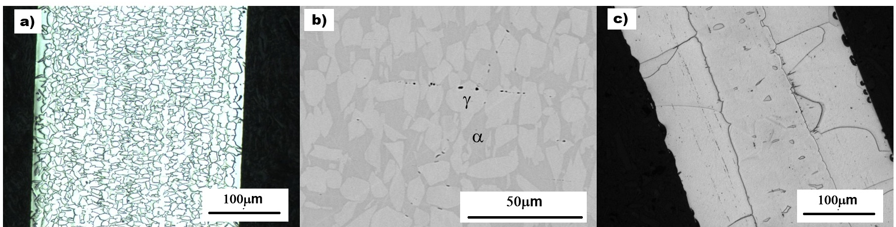
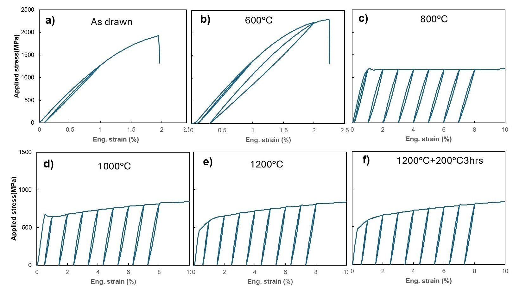
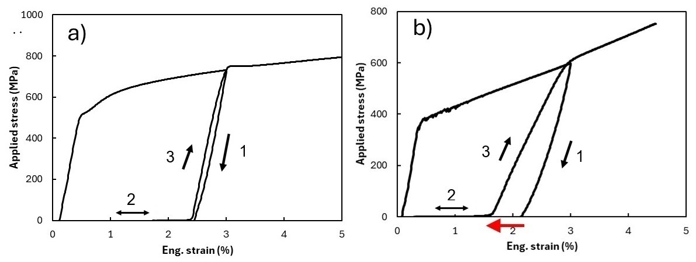
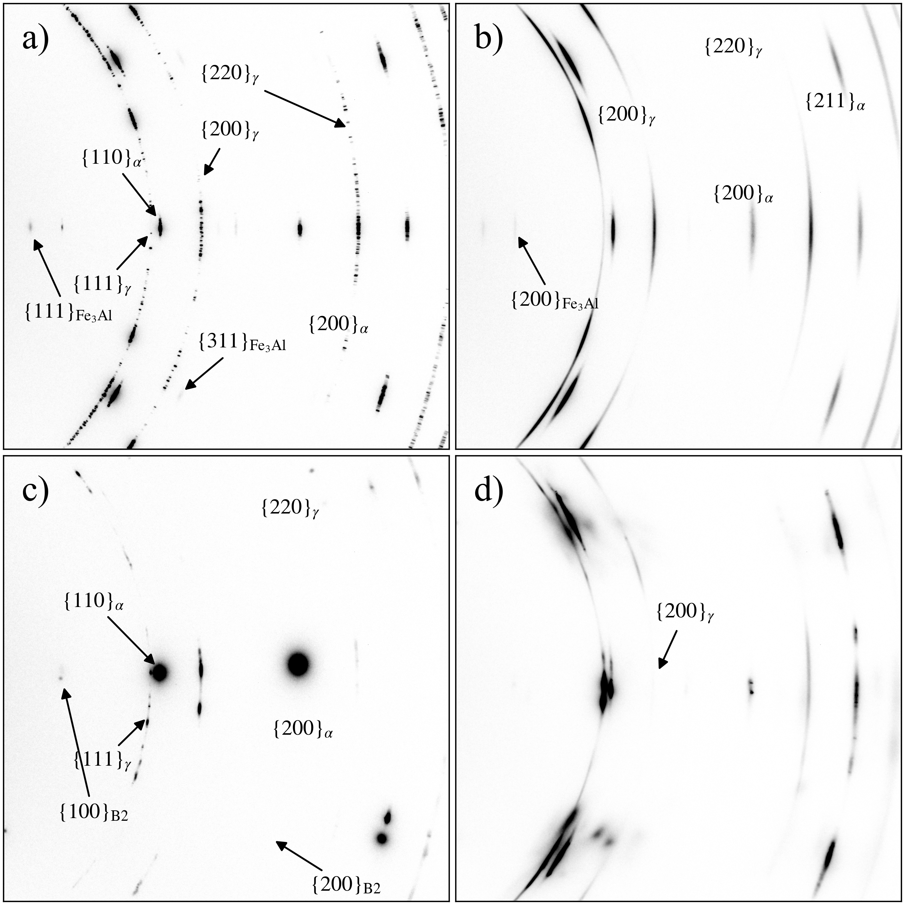
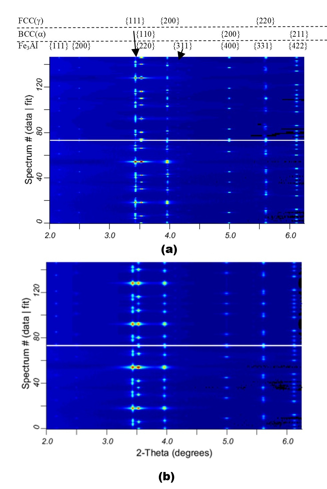
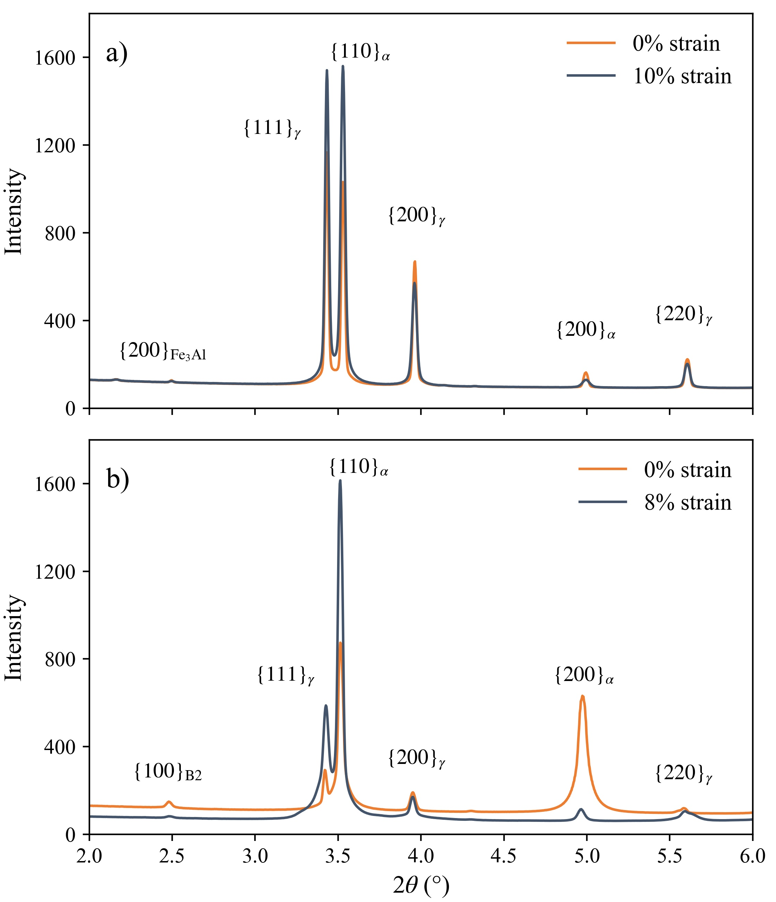

# Abstract

Iron-based shape memory alloys (Fe-SMAs) offer a low-cost alternative to Nitinol, but their super-elastic response is highly sensitive to composition and processing. Large language model (LLM) deep-research agents can now propose new alloy compositions in seconds, raising the question of whether such proposals actually work once synthesized. Here we report the synthesis and mechanical characterization of an LLM-hypothesized Fe-Mn-Al-Si-Ni-C composition, benchmarked against an established super-elastic Fe-Mn-Al-Ni alloy processed under identical conditions. The AI-hypothesized alloy was readily castable but failed to exhibit super-elasticity under any condition tested, deforming instead like a conventional elastic metal. Synchrotron X-ray diffraction showed that this failure stems from a phase-stability mismatch: the AI alloy forms a stable dual-phase microstructure with a minor ordered Fe-Al phase that does not support the transformation pathway the benchmark alloy relies on. Equilibrium CALPHAD calculations across three independent databases, validated against the benchmark, locate the cause precisely. The benchmark solution-treats to single-phase BCC α at 1200 °C, whereas the AI alloy is two-phase there and reaches single-phase α only at ≈1340 °C, above its accessible processing range; deleting carbon alone from the measured chemistry, with every other element held fixed, lowers that field to ≈1150 °C and restores the single-phase state. A carbon addition of ≈0.10 wt% is thus sufficient to close the processing window on which super-elasticity depends. We conclude that LLM-proposed alloy compositions cannot be assumed to work as intended and should be screened for competing phase stability and interstitial content before physical synthesis is attempted — a check that costs minutes of computation with openly available databases.

**Keywords:** Fe-based shape memory alloy; super-elasticity; AI-guided alloy design; CALPHAD; synchrotron XRD; abnormal grain growth

---

# 1. Introduction

Materials discovery has been advanced by deep-learning models trained on first-principles thermodynamics. For example, DeepMind's GNoME predicted more than 2.2 million previously unreported crystal structures with high precision against DFT validation [@merchant2023gnome], and agentic large language models with deep-research capabilities can ingest decades of metallurgical literature and propose compositions in seconds [@comanici2025gemini; @xu2025deepresearch]. Together these tools raise the possibility of alloy design that supplements intuition-guided iteration with AI-proposed, thermodynamically screened candidates. Recent studies have begun applying such AI methods specifically to shape memory alloys, including data-driven composition screening [@aims2022], generative inverse design [@generativeinversion2025], and LLM-based hypothesis generation [@hu2024beyond]. However, whether these AI models practically work or not is yet to be tested. Current generative materials models typically optimize for thermodynamic stability (formation energy, convex-hull distance) but may not, in general, explicitly consider the kinetic barriers governing microstructure evolution during processing [@merchant2023gnome]. A composition whose target phase lies on the DFT convex hull might still be difficult to realize in practice. It is our interest to examine a large language model (LLM)-hypothesized shape memory alloy (SMA). To the best of our knowledge, experimentally validated studies on this topic remain very rare.

SMAs exhibit reversible martensitic transformations that enable two technologically important behaviors: the shape memory effect, in which thermally induced phase changes recover macroscopic deformation, and super-elasticity, in which stress-induced martensite reverts upon unloading [@otsuka2005physical; @lagoudas2008shape]. As the dominant commercial SMA, Nitinol, a near 50Ni-50Ti alloy, offers large recoverable strains of 6–8%, excellent cyclic stability, and biocompatibility, which make it widely used in medical devices, aerospace actuators, and damping applications [@duerig1999overview; @mohd2014nitinol]. However, due to its relatively high manufacturing cost, the application of Nitinol in structural engineering such as prestressing tendons for concrete and seismic dampers remains very limited.

Fe-based shape memory alloys offer a path to lower cost [@cladera2014ironbased]. The work of Omori *et al.* found that certain Fe-Mn-Al-Ni alloys were capable of large strain recovery at room temperature after abnormal grain growth (AGG) [@omori2011superelastic], where a bamboo-like grain structure, or single-crystal-diameter grains spanning the wire cross-section, is produced by cyclic heat treatments across the FCC γ ↔ BCC α phase boundary. Subsequent studies have associated such large grains with reduced inter-granular constraint and improved transformation reversibility in the BCC α / FCC γ system [@vollmer2016cyclic; @abuzaid2019femnnial]. However, achieving a bamboo-like grain structure poses significant challenges, especially at industrial scale. In this study, we adopted this alloy system, trained an AI with over 200 published papers on Fe-based SMAs along with other publicly available information, and asked the AI for lower-cost alternatives with the potential to exhibit super-elasticity with small grain sizes. We processed one of the AI-hypothesized compositions alongside the alloy reported by Omori *et al.* [@omori2011superelastic]. Because the processing history was kept identical for both alloys, compositional differences are the sole variable determining the final mechanical properties.

---

# 2. Materials and Experiments

## 2.1 Alloy design and synthesis

The AI-hypothesized composition was generated by an LLM deep-research agent (Gemini 2.5 with the Deep Research tool [@comanici2025gemini]) prompted to propose an Fe-Mn-Al-based composition optimized for room-temperature super-elasticity. The agent was instructed to (i) reason from the Fe-Mn-Al-Ni family established by Omori and co-workers [@omori2011superelastic; @omori2017martensitic] as a starting point and search for even cheaper alternatives, (ii) consult thermodynamic-stability data, (iii) target β-NiAl/carbide precipitation as a strengthening pathway, and (iv) minimize cost by excluding cobalt and tantalum. Within one of the AI-suggested composition ranges, we selected a composition of 50Fe-30Mn-12Al-4Ni-4Si (at%) with an additional 1000 ppm C, where the Fe, Mn, Al, and Ni are intended to form a BCC parent phase and β (NiAl-type) precipitates. Ni content is kept moderate to lower cost. Si is added to strengthen the parent BCC matrix through solid-solution strengthening; Si is also known to increase resistance to slip in ferritic structures and could potentially modify the stability or morphology of β precipitates, or influence stacking-fault energy. C is added for interstitial strengthening of the parent phase and possible formation of very fine, dispersed carbides. For direct comparison, a second alloy of composition 43.5Fe-34Mn-15Al-7.5Ni (at%), based on the work of Omori *et al.* [@omori2011superelastic], was synthesized under identical conditions. These alloys are hereafter named the AI-alloy and Omori-alloy, respectively.

Using high-purity raw elements, about 2 kg of each alloy was melted in a vacuum induction furnace and cast into ø50 mm ingots. Alloy chemistries are listed in **Table 1**. For both alloys, the actual chemistries measured by inductively coupled plasma atomic emission spectroscopy (ICP-AES) are very close to the nominal values, except that Si is lower in the AI-alloy and unexpected P is present in the Omori-alloy; the source of the P is unknown. Several ø13 mm rods were cut from the cast ingots by electrical discharge machining (EDM). These rods were homogenized at 1000 °C for 16 hours in argon atmosphere, then hot-rolled at 850 °C in multiple passes to reduce thickness, and subsequently cold-drawn to a final wire diameter of 0.36 mm. Severe work hardening during cold drawing necessitated intermediate annealing at 1000 °C under argon to restore ductility between draw passes. The amount of cold drawing was ≈85% area reduction after the last process anneal.

**Table 1.** Chemistries (in wt%) of the two alloys as measured by inductively coupled plasma atomic emission spectroscopy (ICP-AES). Carbon was measured by ASTM E1019. Elements present at less than 0.01 wt% are not listed.

| Element | AI-alloy (nominal) | AI-alloy (actual) | Omori-alloy (nominal) | Omori-alloy (actual) |
|---------|---------------------|---------------------|-------------------------|-------------------------|
| Fe      | 54.5                | 55.83               | 47.08                   | 46.51                   |
| Mn      | 32.3                | 31.78               | 36.43                   | 36.49                   |
| Al      | 6.4                 | 6.24                | 7.9                      | 8.00                     |
| Ni      | 4.6                 | 4.81                | 8.59                     | 8.94                     |
| Si      | 2.2                 | 1.11                | –                        | <0.01                    |
| C       | 0.1                 | 0.105               | –                        | 0.01                     |
| P       | –                   | –                   | –                        | 0.06                     |

## 2.2 Heat treatments

To test the effect of heat-treating temperature on mechanical properties, cold-drawn wires were heat treated in a strand furnace filled with argon at temperatures between 600 and 1200 °C for a dwell time of 1 to 40 minutes, followed by fast cooling to room temperature. In addition, to produce a bamboo-like microstructure, wires were heat treated at 1200 °C for 30 minutes followed by water quench, then re-heated to 900 °C and held for 15 minutes; this cycle was repeated three times before a final heat treatment at 1200 °C for 60 minutes followed by water quench. The same heat treatment has been used by others to promote abnormal grain growth [@omori2016agg]. Heat treatment above 1200 °C caused severe oxidation or furnace contamination.

## 2.3 Metallography

Wire cross-sections were embedded in cold-mount epoxy and ground sequentially with silicon-carbide papers from 180 grit through 800 grit. Final polishing used a 0.25 µm OP-S aluminum-oxide suspension on an automated polishing wheel until a scratch-free mirror finish was achieved. Polished cross-sections were imaged on a Clemex Vision PE optical microscope under bright-field illumination at magnifications between 100× and 1000×. In addition, scanning electron microscopy (SEM) and energy-dispersive spectroscopy (EDS) were used to study microstructure and local chemistry.

## 2.4 Mechanical testing

Room-temperature cyclic tensile testing was performed on an Instron in displacement control. During the test, each specimen was cyclically loaded to fracture with a 1% strain increment for each cycle. The sample gauge length was 13 mm and the strain rate was 1 × 10⁻³ s⁻¹. This test reveals the material's super-elasticity. A special loading–unloading–heating cyclic tensile test was also conducted to evaluate any potential shape-memory response. In this case, selected samples were loaded to 3% strain, unloaded to zero stress, and continued to zero strain. At the same time, the sample was heated to ≈200 °C to trigger any potential reversal of martensite to austenite. In this test, any shape-memory effect would be revealed during the heating stage, which causes the reloading stress to rise at a lower deformation strain.

## 2.5 Synchrotron X-ray diffraction

To identify phase constitution and potential phase change, synchrotron XRD measurements were performed at the ultra-hard X-ray multifunctional application beamline BL12SW of the Shanghai Synchrotron Radiation Facility (SSRF) [@tai2024ssrf; @yang2024ssrf]. The incident wavelength was λ = 0.12587 Å with a beam size of 0.5 × 0.5 mm². Two-dimensional Debye–Scherrer patterns were collected from each specimen before and after tensile deformation to test for any potential phase transformation. These 2D images were processed using FIT2D [@hammersley1998fit2d], where diffraction data were sliced at 5-degree intervals along the 360-degree azimuth and integrated to generate 72 diffraction spectra, which were then fitted by Rietveld refinement [@rietveld1969] in MAUD software [@lutterotti1997maud] to identify phase constitutions, volume fractions, and crystal orientations of the different phases.

## 2.6 Equilibrium thermodynamic calculations

Equilibrium phase fractions were computed with the CALPHAD method [@lukas2007calphad] using pycalphad 0.11.2, an open-source Python implementation of the Gibbs-energy-minimization formalism [@otis2017pycalphad]. Isoplethal step diagrams were calculated at 1 atm from 400 to 1400 °C in 10 °C increments; a first pass on a 20 °C grid reproduced every shared point exactly, confirming that the results are grid-independent. Input compositions were the ICP-AES chemistries of **Table 1** converted to atomic percent, so that the calculations describe the alloys as actually cast rather than as nominally specified: Fe–29.8Mn–11.9Al–4.2Ni–2.04Si–0.45C for the AI-alloy and Fe–34.1Mn–15.2Al–7.8Ni–0.10P–0.04C–0.02Si for the Omori-alloy. A third, virtual composition was also evaluated — the measured AI-alloy chemistry with carbon removed and every other element held at its measured value. This is an in-silico control that isolates the effect of carbon alone, which no pair of physically cast heats can do.

No single publicly available thermodynamic database assesses Fe–Mn–Al–Ni–Si–C simultaneously *and* models the B2, D0₃ and κ ordered phases relevant here, so three independent assessments were used and only their points of agreement are reported. Agreement between separately assessed databases is stronger evidence than a single calculation. The primary database was **mpea-02b** [@hallstedt2017mpea; @hallstedt2023mpea], the only one covering Fe–Mn–Al–Ni–C together, in which B2 is treated as an ordered partition of the disordered A2 lattice; it does not contain Si. **PrecHiMn-04** [@prechimn04] was used as a cross-check because it is the only one that models D0₃ (through a four-sublattice bcc description) and κ-(Fe,Mn)₃AlC while also carrying Si, though it contains no Ni. **mc_fe v2.059** [@mcfe] provided the broadest element coverage and is the only database able to carry Si, C and the Omori-alloy's 0.06 wt% P at once, at the cost of the least detailed ordering description. Where a database does not assess an element that is present in the alloy, that element was omitted and the remaining composition renormalized to unity; this shifts the modelled elements by at most 0.6 at% from the chemistries quoted above, so that the composition solved in mpea-02b for the AI-alloy is Fe–30.5Mn–12.2Al–4.3Ni–0.46C. For partitioned phases the degree of long-range order was evaluated from the refined sublattice site fractions rather than assumed from the phase name, and an ordered structure was reported only where the substitutional sublattice occupancies differed by more than 0.05.

Four limitations should be borne in mind when reading these calculations. First, they describe equilibrium, whereas the wires were annealed for 1 to 40 minutes and cooled rapidly; equilibrium is the destination, not the as-quenched state. Second, Si is absent from the primary database. Because Si is a ferrite stabilizer, omitting it biases that database toward γ, which is the same direction as the conclusion drawn below; the omission is therefore not conservative and must be checked rather than argued away. Both of the other databases carry Si at its measured 2.04 at%, and both return *less* α at 1200 °C than the Si-free primary database does (Sec. 3.4), so the calculated duplex constitution of the AI-alloy is not an artifact of the missing element. Third, pycalphad reports that the magnetic contribution to the partitioned B2 description is not fully substituted into the disordered part, so B2 fractions were cross-checked against mc_fe, which models B2 as an independent phase. Fourth, PrecHiMn-04 is assessed for high-Mn steels at far lower Al than the 12 at% present here and returns an unphysical β-Mn-dominated result below ≈600 °C; its use is therefore restricted to the D0₃ and κ questions and to the high-temperature α field. All calculation scripts, database provenance and raw output are archived with the data for this paper.

---

# 3. Experiment Results

## 3.1 Microstructure

**Fig. 1a** shows the microstructure of the AI alloy after heat treatment at 1200 °C for 1 minute. The material exhibits a highly refined, fine-grained equiaxed microstructure with average grain diameters well under 20 µm. Scanning electron microscopy (**Fig. 1b**) identifies this morphology as an intimate mixture of a matrix (darker grey area) interlocked with blocky islands (brighter areas). EDS analysis detected higher Al content in the matrix but more Mn in the blocky islands, suggesting that the AI alloy has a dual-phase structure, where the Al-rich areas are likely BCC α-phase and the Mn-rich areas are FCC γ-phase. Prolonging the annealing duration to 40 minutes at the same temperature (**Fig. 1c**) induces drastic grain-boundary migration driven by the reduction of total interfacial free energy, resulting in severe grain growth and structural coarsening: the initial fine network is completely replaced by a coarse morphology with individual grains exceeding 100 µm in width. However, the dual-phase nature remains unchanged even after prolonged heat treatment at this temperature, as discussed further below.

## 3.2 Cyclic stress–strain response

Cyclic tensile stress–strain curves for the AI alloy after heat treatment at different temperatures are shown in **Fig. 2**, and the corresponding data are listed in **Table 2**. This information reveals a broad picture of how heat treatment governs the alloy's mechanical properties. The response is strongly anneal-dependent: low strand-anneal temperatures (600–700 °C) leave the wire high-strength but brittle (tensile strengths of ≈2009–2293 MPa and yield strengths of ≈1683–1948 MPa, but elongation of only ≈2%), reflecting incomplete recrystallization of the cold-drawn wire, whereas annealing at 800–1200 °C progressively softens the wire and restores ductility, with elongation peaking near 33% at 1000 °C. The elastic modulus, E, stays in the ≈150–165 GPa range across the well-annealed conditions. Across all AI-alloy heat treatments examined, the stress–strain curves rose monotonically with no defined transformation plateau, and the recovered strain on unloading is comparable to the elastic strain (σ/E) expected at the unload stress. In other words, the strain recovery is consistent with elastic springback alone, with no resolvable pseudo-elastic contribution. It has been reported that aging at 200 °C can improve the pseudo-elasticity of Fe-Mn-Al-Ni alloy [@tanaka2010science; @vollmer2019natcomm]; this was not the case for the AI alloy (**Fig. 2f**).

**Table 2.** Mechanical properties of the AI alloy after heat treatment for 1 minute at different temperatures.

| Temp. (°C) | σ₀.₂ (MPa) | UTS (MPa) | Elong. (%) | E (GPa) |
|------------|------------|-----------|------------|---------|
| As drawn   | 1528       | 1925      | 2.0        | 143.7   |
| 600        | 1948       | 2293      | 2.3        | 157.4   |
| 700        | 1683       | 2009      | 2.2        | 164.8   |
| 800        | 1167       | 1216      | 24.0       | 155.5   |
| 900        | 944        | 1078      | 29.7       | 152.2   |
| 1000       | 673        | 967       | 33.4       | 155.6   |
| 1100       | 556        | 947       | 29.7       | 156.8   |
| 1200       | 502        | 938       | 23.9       | 163.0   |

**Fig. 3** compares the stress–strain behavior of the AI and Omori alloys during cyclic loading–unloading–heating deformation. In this test, any residual stress-induced martensite present at zero stress should transform back to austenite upon heating, causing the reloading stress to rise at a strain lower than the last unloading strain. This is exactly what happened in the Omori alloy: **Fig. 3b** shows that its residual strain after unloading from 3% deformation is ≈2.2%, and upon reloading, stress rises at a strain of ≈1.7%. This 0.5% strain recovery caused by heating is evidence of stress-induced martensite transformation in the Omori alloy — the stress-induced martensite was stable enough to survive unloading but transformed back to austenite upon heating. By contrast, **Fig. 3a** shows no strain recovery of the AI alloy during this test, indicating that it deforms plastically with no pseudo-elasticity regardless of heat-treating condition. We conclude that the microstructure of the AI alloy is very stable and that stress-induced phase transformation is not one of its active deformation mechanisms.

## 3.3 Synchrotron diffraction and phase identification

Synchrotron XRD of samples before and after deformation is shown in **Fig. 4**. **Fig. 5** shows good overall agreement between the experimental data (lower half) and the results of Rietveld refinement (upper half) for the AI alloy. Based on this result, the AI alloy is estimated to consist of ≈62% FCC γ-phase, ≈34% BCC α-phase, and ≈4% DO₃ Fe₃Al phase. Its diffraction patterns before and after deformation are essentially the same (**Fig. 4a, b**), and relative peak intensities (**Fig. 6a**) are essentially unchanged: no new diffraction peaks appear and none disappear. Although an ex-situ measurement made after unloading cannot, on its own, exclude a fully reversible transformation that reverts on unloading, the absence of any mechanical recovery (**Figs. 2 and 3**) together with the unchanged multi-phase pattern points consistently to deformation by dislocation slip rather than stress-induced phase transformation. The shift from sharp, discrete spotty patterns in the undeformed state (**Fig. 4a**) to broader, partially arced rings after deformation (**Fig. 4b**) can be attributed to dislocation activity, which results in peak broadening and/or the formation of tiny sub-grains. In comparison, the Omori alloy presents a BCC α-dominated pattern with FCC γ-phase and ordered β-NiAl (B2) precipitate diffractions in the undeformed state (**Fig. 4c**); after 8% applied strain, the {111}γ reflection intensifies and the overlapping {200}α redistributes in intensity (**Fig. 4d**), consistent with stress-induced γ formation and partial variant activation. The change in peak intensity after deformation of the Omori alloy is also clearly shown in **Fig. 6b**.

It is worth noting that the AI alloy after AGG heat treatment showed an X-ray diffraction pattern similar to **Fig. 4a**, indicating that the multi-phase microstructure is a stable state of this alloy at 1200 °C.

## 3.4 Equilibrium phase stability

**Fig. 7** shows the calculated equilibrium step diagrams for the two alloys as cast, using the measured chemistries of **Table 1**. The virtual carbon-free composition described in Sec. 2.6 was evaluated on the same basis; because all three databases agree on it, it is reported numerically in **Table 3** rather than plotted.

The Omori-alloy (**Fig. 7a**) reproduces the phase sequence its processing route assumes. A single-phase disordered bcc α field opens at ≈1140 °C and extends to the top of the calculated range, so the 1200 °C solution treatment of Sec. 2.2 lies inside it. On cooling below ≈1090 °C the bcc orders: between ≈700 and 1000 °C the calculated bcc is fully B2-ordered and accounts for 19–21% of the alloy, the balance being γ. The equilibrium state below ≈1090 °C is thus B2 + γ, and not the coherent B2-in-α nanostructure on which the benchmark's super-elasticity actually rests; that nanostructure is a kinetically arrested approach to this equilibrium, obtained by quenching the single-phase α and ageing it where B2 can order but γ cannot yet nucleate. What the calculation establishes is that both conditions the processing route requires are available and contiguous: a temperature at which the alloy is single-phase α, and a range immediately below it in which that α has a thermodynamic driving force to order. Nothing about this alloy was fitted here; the calculation is a control, and it recovers the ≈20% ordered bcc that is observed directly in **Fig. 4c**.

The AI-alloy behaves differently in every respect that matters (**Fig. 7b**). At 1200 °C it is not single-phase but a duplex mixture of 71.1% α and 28.9% γ. Its single-phase α field does not open until ≈1340 °C — some 140 °C above the 1200 °C ceiling imposed by oxidation and furnace contamination (Sec. 2.2). The margin is in fact larger than that ceiling alone implies: mc_fe, the only database here carrying all six elements plus P, places the onset of incipient melting in this alloy at ≈1240 °C, so the single-phase α field would be unreachable even if oxidation were not the limiting factor. The databases do not agree on the solidus — mpea-02b returns no liquid at all below 1400 °C — but they agree on what matters here, which is that the temperature at which this composition becomes single-phase α lies outside the window in which it can be annealed. Between ≈850 and ≈1050 °C the alloy is calculated to be fully austenitic. Ordered bcc appears only below ≈850 °C, reaches at most ≈11% at 400 °C, and forms within a γ matrix rather than an α one. There is thus no temperature at which this composition can be solution-treated to single-phase α and subsequently aged into coherent ordered precipitates within that α — the sequence on which the benchmark relies.

Removing carbon and holding every other element fixed restores the missing field, and does so in every database. The single-phase α window opens at ≈1150 °C instead of ≈1340 °C in mpea-02b and at ≈1160 °C instead of ≈1390 °C in PrecHiMn-04, while mc_fe — which returns no single-phase α at all for the carbon-bearing composition below 1400 °C — places it at ≈1130 °C. The 1200 °C solution treatment therefore lands inside the single-phase field once carbon is removed, and the alloy reaches 100% α exactly as the benchmark does, in all three databases and despite their covering different element sets (**Table 3**).

**Table 3.** Calculated equilibrium phase fractions (mol%) at 1200 °C, the solution-treatment temperature. The Omori-alloy cannot be evaluated in PrecHiMn-04, which contains no Ni.

| Alloy | mpea-02b | PrecHiMn-04 | mc_fe v2.059 |
|---|---|---|---|
| Omori-alloy | 100 α | – | 100 α |
| AI-alloy | 71.1 α + 28.9 γ | 64.5 α + 35.5 γ | 61.9 α + 38.1 γ |
| AI-alloy, C removed | 100 α | 100 α | 100 α |

Two further predictions bear on phases reported in Sec. 3.3. Carbide phases are calculated to be stable only well below the processing range: M₂₃C₆ appears in mpea-02b only below ≈420 °C, and κ-(Fe,Mn)₃AlC reaches 0.2–2.4% below ≈590 °C in PrecHiMn-04 and 0.1–0.8% between 510 and 540 °C in mc_fe. Neither is expected at or near 1200 °C. Separately, the ordered bcc of PrecHiMn-04 — the only description here capable of returning D0₃ — refines to the disordered A2 state at every temperature calculated, indicating that at ≈12 at% Al this composition lies below the equilibrium Fe₃Al D0₃ field.

![**Fig. 7.** Calculated equilibrium step diagrams (mpea-02b database) for (a) the Omori-alloy, the benchmark, and (b) the AI-alloy, the LLM-hypothesized composition. Both were computed from the measured ICP-AES chemistries of Table 1 converted from wt% to at%: Fe–34.1Mn–15.2Al–7.8Ni–0.04C and Fe–29.8Mn–11.9Al–4.2Ni–2.04Si–0.45C respectively. mpea-02b does not model Si, which was therefore omitted and the remaining elements renormalized (Sec. 2.6). The shaded band is the ordered (B2) portion of the total bcc fraction; it lies beneath the total bcc curve because B2 is an ordered partition of that phase rather than a separate one. The dashed line marks the 1200 °C solution-treatment temperature. The carbon-free control composition is reported in Table 3.](figures/Figure_7.png)

---

# 4. Discussion

## 4.1 Origin of the absence of stress-induced phase transformation

The failure of the AI-hypothesized alloy (50Fe-30Mn-12Al-4Ni-4Si at% with 1000 ppm C) to exhibit super-elasticity or a shape-memory response can be attributed to a fundamental misalignment between its phase stability and its active deformation mechanisms. In Fe-Mn-Al-Ni shape-memory systems, super-elastic behavior is contingent upon a reversible, stress-induced martensitic transformation from a BCC α parent phase to FCC γ martensite. However, quantitative Rietveld refinement of the synchrotron XRD data reveals that the AI-alloy is structurally dominated by the γ-phase (≈62%), whereas the α-phase accounts for only ≈34% of the volume fraction, with a further ≈4% present as ordered D0₃ (Sec. 3.3). Compared to the Omori alloy (43.5Fe-34Mn-15Al-7.5Ni at%), the AI alloy has less Mn, Al, and Ni, but higher Fe, Si, and C. It is known that Fe, Si, and Al stabilize the BCC α-phase, while Mn, Ni, and C stabilize the FCC γ-phase [@bhadeshia2010steels]. The original hypothesis was that these chemistry changes would not alter the phase constitution or stability, and that the additional C could also increase material strength to impede dislocation slip and promote stress-induced phase transformation. In practice, this chemistry modification favors the FCC crystal structure and raises γ-phase stability, and the equilibrium calculations of Sec. 3.4 identify carbon as the element that closes the single-phase α field at the solution-treatment temperature (Sec. 4.2).

The thermodynamic calculations place this argument on a quantitative footing and change its emphasis. The problem is not that the AI-alloy possesses a BCC parent phase with an insufficient driving force for transformation; it is that no accessible heat treatment produces that parent phase in the first place. At 1200 °C the alloy is calculated to be a two-phase α + γ mixture in all three databases, and its single-phase α field lies at ≈1340 °C, above both the oxidation limit of the process and the ≈1240 °C solidus returned by mc_fe (Sec. 3.4). The duplex constitution that the calculation predicts at the solution-treatment temperature is precisely what is observed: the interlocked matrix-plus-blocky-island morphology of **Fig. 1b**, the Al-rich and Mn-rich EDS partitioning that accompanies it, and the coexisting α and γ reflections of **Figs. 4a and 5**. It also explains why the microstructure is insensitive to annealing time — the duplex state survives 40 minutes at 1200 °C (**Fig. 1c**) and the full AGG cycle (Sec. 3.3) because it is the equilibrium state at that temperature, not an incompletely transformed one. That the same calculations independently reproduce the Omori-alloy's single-phase α field and its ≈20% ordered B2 (**Fig. 7a**), neither of which was fitted here, is what licenses their application to the test alloy.

One quantitative discrepancy should be stated plainly. The calculations place α in the majority at 1200 °C (62–71%), whereas the refinement of the quenched wire places γ in the majority (≈62%); the two agree that the alloy is duplex but not on which phase dominates. Because γ is the transformation product rather than the parent in this system, a partial α → γ transformation during cooling would invert the ratio, which would place the martensite start temperature above room temperature. That reading would supply a more complete account of the absence of super-elasticity than a driving-force argument alone — the transformation would already have run before the specimen was ever loaded, leaving nothing to induce — and it is what elevated carbon content would be expected to produce. It is also consistent with the EDS assignment of Sec. 3.1, in which the α-phase forms the matrix. We note it as the reading the present data favor rather than as an established result; direct calorimetric measurement of the transformation temperatures is required to confirm it, and is the most informative single experiment remaining on this alloy.

The calculations also clarify the status of the ordered phases. D0₃ is not predicted to be an equilibrium phase at ≈12 at% Al (Sec. 3.4), yet it is observed. Its presence is therefore best understood as a metastable ordering product formed on cooling — exactly the kind of kinetic outcome that a screening step based on composition and equilibrium thermodynamics alone cannot anticipate. Conversely, the ordered bcc that the AI-alloy can form at equilibrium is small (≤11%) and confined below ≈850 °C. At those temperatures both alloys are calculated to be ordered bcc coexisting with γ; what separates them is the step before. The benchmark can be quenched from a single-phase α field and then aged, so that B2 orders coherently within α before γ has time to nucleate. The AI-alloy has no accessible single-phase α field to quench from (Sec. 3.4), so there is no α matrix in which coherent B2 could form, and the microstructure the benchmark relies upon is unavailable to this composition at any temperature. This is a stronger statement than the absence of a B2 reflection alone would support, and it accounts for the failure of the 200 °C ageing treatment (**Fig. 2f**) to induce any pseudo-elastic response.

Furthermore, mechanical and structural analyses indicate that the AI-alloy accommodates macroscopic deformation via irreversible dislocation slip rather than phase transitions. Whereas the Omori-alloy relies on coherent, ordered β-NiAl (B2) precipitates within its BCC matrix to suppress permanent slip and promote transformation reversibility, the AI-alloy instead forms a D0₃ Fe₃Al phase. Without the precipitation-hardening effect provided by fine B2 precipitates, the matrix lacks sufficient resistance to plastic flow. This is confirmed by the post-deformation synchrotron XRD patterns, where the transition from sharp, discrete spots to broad, partially arced rings reflects dislocation multiplication and sub-grain formation. Thus, the microstructural state of the AI-alloy remains highly stable at 1200 °C, favoring dislocation- or twinning-mediated plasticity over stress-induced martensitic transformation.

## 4.2 The role of carbon

Five elements differ between the two alloys, so no comparison of the two cast heats can by itself establish which of them is responsible for the loss of super-elasticity. On a plain atomic-percent basis carbon is the smallest of the five changes, and singling it out — as the original hypothesis did — would otherwise be arbitrary. The virtual carbon-free composition of Sec. 3.4 is the control that resolves this, because it changes carbon alone while holding Fe, Mn, Al, Ni and Si at the values actually measured in the cast wire.

The result is unambiguous and reproduces across all three databases (**Table 3**). Deleting 0.45 at% (≈0.10 wt%) carbon moves the α solvus of the AI-alloy from ≈1340 °C to ≈1150 °C, a shift of roughly 190 °C, and converts the equilibrium constitution at 1200 °C from a 62–71% α + 29–38% γ mixture into 100% α — the same single-phase state the Omori-alloy reaches at that temperature. Carbon, at a concentration of one part in a thousand by weight, is what closes the solution-treatment window on which the entire processing route depends.

Two elements are exonerated by the same calculation. Silicon was added as a ferrite stabilizer and solid-solution strengthener, and it remains at its measured 2.04 at% in the carbon-free variant of both Si-bearing databases, which nonetheless return 100% α at 1200 °C; silicon therefore does not obstruct the single-phase field, and the shortfall in the as-cast alloy is not attributable to it. The same argument applies to the reduction in Ni from 7.8 to 4.2 at%, which is likewise held at its measured value in the control.

The limits of this conclusion should be stated as clearly as the conclusion itself. Carbon is decisive at the temperature where the process operates, not across the whole temperature range. Over roughly 850–1020 °C both the as-measured composition (**Fig. 7b**) and the carbon-free control are calculated to be fully austenitic, so the lower Al and Ni contents of the AI-alloy do move the α/γ boundary independently of carbon. The defensible claim is therefore narrower and more useful than "carbon caused the failure": carbon closes the single-phase α field at the solution-treatment temperature, and without that field the alloy cannot be brought into the parent state that super-elasticity requires, whatever the other elements do elsewhere. Nor is a calculated control a substitute for the experiment it stands in for. Casting this composition without carbon and processing it identically remains the direct test; what the calculation contributes is to reduce that test from an open compositional search to a single, well-specified heat.

Carbon was added on the expectation that it would strengthen the parent phase interstitially and, through fine dispersed carbides, raise the resistance to slip enough to favor stress-induced transformation over plasticity. The calculations indicate that neither mechanism was available. Carbides are predicted to be stable only well below the processing range — M₂₃C₆ below ≈420 °C, κ-(Fe,Mn)₃AlC below ≈590 °C and never above ≈2.4% — so no carbide dispersion exists at or near 1200 °C to provide the intended strengthening, and none was observed. This places the AI-alloy in an unfavorable position with respect to the Fe-Mn-Al-C lightweight-steel family, whose compositional field it otherwise resembles: those alloys derive their strength from κ-carbide precipitation at carbon contents of 1–1.5 wt%, an order of magnitude above the ≈0.10 wt% present here. The AI-alloy carries enough carbon to incur the γ-stabilization penalty that destroys the shape-memory field, but not enough to collect the precipitation strengthening that would justify it.

Two general points follow. First, the sensitivity of this alloy family to interstitial content is severe enough that carbon must be treated as a primary design variable rather than a minor addition, and specified and controlled accordingly — a 1000 ppm addition is not a perturbation here. Second, the calculation that establishes all of this takes minutes on a desktop computer and uses only openly available databases. Had it been run before melting, it would have rejected the composition at the point where the intended 1200 °C solution treatment was found to lie 140 °C below the alloy's single-phase α field.

## 4.3 Anneal-temperature dependence of mechanical properties

Although the AI alloy did not show super-elastic behavior, its monotonic tensile behavior varies strongly with annealing temperature, and the trends are exactly those expected for a cold-drawn wire passing through recovery, recrystallization, and grain growth. Reading these as a single-specimen survey, three regimes emerge.

At the lowest temperatures (600–700 °C) the wire is very strong but essentially brittle: tensile strengths of ≈2009–2293 MPa and yield strengths of ≈1683–1948 MPa, but elongation of only ≈2%. These temperatures are below the recrystallization range of the heavily cold-drawn wire, so annealing here drives only recovery (relief of residual drawing stresses and partial rearrangement of the dislocation substructure) without nucleating new strain-free grains. The high dislocation density retained from cold drawing is what sustains the high strength, and the small ductility gains in this window reflect stress relief rather than any genuine restoration of formability; the wire still fractures soon after yield.

The abrupt change near 800 °C marks the onset of recrystallization. Elongation jumps from 2.2% at 700 °C to 24.0% at 800 °C, while tensile strength falls from 2009 to 1216 MPa and yield strength from 1683 to 1167 MPa. This discontinuity — rather than a smooth softening — is the signature of recrystallization: new equiaxed, strain-free grains nucleate and consume the deformed matrix, removing most of the stored dislocation content and abruptly restoring ductility. It is this recrystallization threshold, not a gradual process, that makes ductility appear only above ≈800 °C.

From 800 to 1200 °C the wire is fully recrystallized and the dominant process is grain growth. Yield strength falls monotonically with temperature (1167 → 502 MPa) as a result of continuous grain growth; larger grains allow more uniform slip, which raises elongation to a peak of ≈33% near 1000 °C. In other words, across this regime, increasing grain size simultaneously decreases strength and increases ductility — the classic strength–ductility trade-off of a single-phase-controlled structural metal. Above 1000 °C, elongation eases back slightly (29.7% at 1100 °C, 23.9% at 1200 °C), which we attribute to excessive coarsening reducing uniform elongation even as the matrix continues to soften. Throughout the sweep, the elastic modulus stays within ≈150–165 GPa, as expected for a structure-insensitive property of an essentially unchanged multi-phase mixture.

## 4.4 Implications for AI-guided alloy design

The AI-guided alloy design did not achieve the intended super-elastic or shape-memory behavior because the model primarily relied on thermodynamic and literature-based correlations rather than a complete understanding of the complex phase-transformation mechanisms required for functional Fe-based SMAs. As shown in this study, the AI-hypothesized alloy developed a stable multiphase microstructure consisting mainly of FCC γ and BCC α phases, and neither mechanical testing nor synchrotron diffraction provided evidence of stress-induced martensitic transformation; deformation was instead accommodated largely by conventional dislocation slip. Although the composition appeared reasonable from a thermodynamic and strengthening perspective, the AI model was unable to accurately predict the delicate balance among phase stability, transformation driving force, defect structure, precipitation behavior, and processing history that governs pseudo-elasticity. This outcome highlights a current limitation of AI-assisted alloy design: available models are often trained on composition–property relationships and equilibrium thermodynamics, while kinetic effects and microstructure evolution during manufacturing remain insufficiently represented.

The calculations reported here allow this limitation to be stated as a concrete and inexpensive remedy rather than a general caution. The screening step that would have caught this composition is a single equilibrium step diagram, evaluated not for the existence of the desired phase but for whether the phase fields required by the *intended processing route* overlap the temperatures at which that route can actually be run. For a Fe-Mn-Al-Ni shape-memory alloy the test has two parts: does a single-phase α field exist below the practical annealing limit, and does an ordered-precipitate field exist below it within that same α matrix? The AI-alloy fails the first, and would fail the second even if the first were satisfied. Neither question requires proprietary software or measured data on the candidate itself, and answering both took minutes. It is notable that the deep-research agent was explicitly instructed to consult thermodynamic-stability data (Sec. 2.1) and nonetheless proposed a composition that fails this test, which suggests that the useful distinction is not between AI-assisted and conventional design but between design workflows that terminate in a verified calculation and those that terminate in a plausible narrative. A generated composition should be treated as a hypothesis to be screened, not as a result.

Nevertheless, AI-assisted alloy design is likely to become increasingly successful. As larger experimental databases become available and models begin to incorporate processing history, microstructural evolution, kinetic simulations, and deformation mechanisms alongside thermodynamic calculations, AI will be able to make more physically informed predictions. Future materials-design frameworks that integrate first-principles calculations, phase-field modeling, CALPHAD databases, high-throughput experiments, and machine learning may better capture the conditions required for martensitic transformations and functional properties. Rather than replacing metallurgical expertise, AI is expected to serve as a powerful tool for rapidly narrowing the compositional search space, generating testable hypotheses, and accelerating discovery. The present study should therefore be viewed not as a failure of AI itself, but as evidence that current AI models have not yet fully captured the complexity of structure–processing–property relationships in shape memory alloys.

---

# 5. Conclusions

An AI-guided deep-research workflow was used to design a low-cost Fe-Mn-Al-based alloy targeting room-temperature super-elasticity. The proposed alloy was successfully synthesized and compared with the benchmark Fe-Mn-Al-Ni alloy reported by Omori *et al.* under identical processing conditions. The AI-designed alloy developed a stable dual-phase FCC/BCC microstructure and exhibited deformation primarily through dislocation slip rather than stress-induced martensitic transformation. Consequently, neither super-elasticity nor shape-memory behavior was observed, whereas the reference alloy showed clear evidence of transformational deformation.

Equilibrium CALPHAD calculations, performed with three independent open databases and validated against the benchmark alloy, identify the origin of this failure. The benchmark solution-treats to single-phase α at 1200 °C and orders on cooling below ≈1090 °C to the ≈20% ordered bcc that its processing route requires. The AI-alloy does neither: at 1200 °C it is a two-phase α + γ mixture, and its single-phase α field lies at ≈1340 °C, above the temperature at which the alloy can be annealed without oxidation or incipient melting. Removing carbon alone from the measured chemistry, with every other element held fixed, lowers that field to ≈1150 °C and restores the single-phase state at 1200 °C in all three databases. A carbon addition of ≈0.10 wt%, the smallest compositional change of the five that distinguish the two alloys, is therefore sufficient to close the processing window on which super-elasticity depends.

These results highlight an important limitation of current AI-assisted alloy design. While AI can rapidly generate compositionally plausible alloy candidates based on thermodynamic considerations and literature knowledge, it does not yet fully capture the complex interactions among composition, processing, microstructure evolution, and deformation mechanisms that govern shape-memory performance. They also point to a specific and inexpensive remedy: an equilibrium step diagram, checked for overlap between the phase fields the intended processing route requires and the temperatures at which that route can be run, would have rejected this composition before 2 kg of it was melted. Nevertheless, this work demonstrates the value of experimentally validating AI-generated hypotheses and suggests that future models incorporating kinetic effects, phase transformations, and processing history may become powerful tools for accelerated alloy discovery.

---

# Acknowledgments

The authors thank Fort Wayne Metals for providing access to melting, hot-rolling, cold-drawing, and metallography facilities, and for technical guidance throughout alloy synthesis.

S. Cai also thanks his colleagues Andrew Michael for melting the alloys and Todd Darley for SEM analysis. Synchrotron X-ray diffraction was carried out on beamline BL12SW at the Shanghai Synchrotron Radiation Facility (SSRF) under proposal No. 2024-SSRF-PT-505463. The authors acknowledge beamline BL12SW (http://cstr.cn/31124.02.SSRF.BL12SW) of the SSRF for experimental support. Data analysis was performed using the FIT2D and MAUD software.

---

# Declarations

**Funding.** No external funding was received for this work.

**Competing interests.** The authors declare no competing interests.

**Generative AI use.** An LLM deep-research agent (Google Gemini 2.5, Deep Research) was used to hypothesize the AI-alloy composition under study, as described in Sec. 2.1; this use is a study method, not a manuscript-preparation aid. No generative AI tools were used to draft, edit, or otherwise prepare the text of this manuscript.

**Data availability.** ICP-AES and interstitial-gas (ASTM E1019) chemistry certificates for both heats, raw synchrotron diffraction data, Instron cyclic-tensile export data, and metallographic images are available from the corresponding author on reasonable request. The scripts used to compute the equilibrium step diagrams of Sec. 3.4, together with the resulting phase-fraction tables and the calculation logs, are also available on request; the thermodynamic databases themselves are the property of their respective authors and must be obtained from the sources cited in Sec. 2.6.

---

<!-- REFERENCES TO FOLLOW IN BIBLIOGRAPHY BUILD -->
